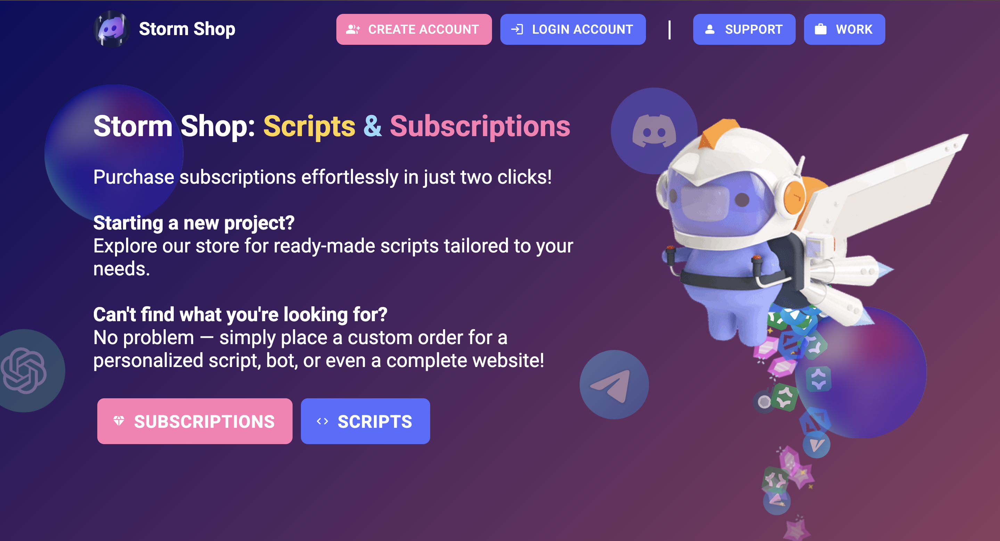

This App is currently in Development!

# What StormShop is ...

StormShop is a project that sells scripts and subscriptions (mostly for Russian users).
You can buy it on our [website](https://nitro-storm.ru) / [telegram bot](https://t.me/storm_nitro_shop_bot) / [discord server](https://discord.gg/BNsV86yGQA) ... etc.

What about scripts? You can easily buy them on our [website](https://nitro-storm.ru). After purchasing you get the archive and README.md file with all instructions. If you wish, we can add you into private GitHub repository with the script you purchased!

# How to Install

```
git clone https://github.com/habidoyetech/storm-shop-assessment.git

npm install

npm start
```

# Basic Technical Test



1. Removed Subscripts and Scripts Buttons from header
2. Added `Create Account` and `Login Account` buttons
